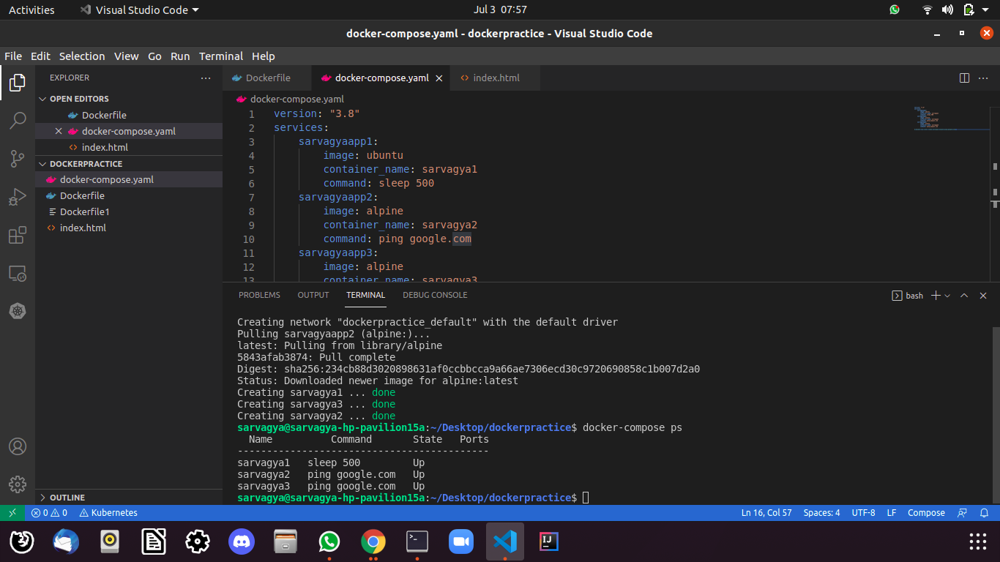

# Project_Team-Intruder


# Docker-Compose_File for Container Creation
```
version: "3.8"
services: 
    sarvagyaapp1:
        image: ubuntu
        container_name: sarvagya1
        command: sleep 500
    sarvagyaapp2:
        image: alpine
        container_name: sarvagya2
        command: ping google.com
    sarvagyaapp3:
        image: alpine
        container_name: sarvagya3
        command: ping google.com

# docker run -itd --name sarvagya alpine ping google.com
```

# Docker-Compose Commands
```
docker-compose up -d
docker-compose stop 
docker-compose start
docker-compose down
docker-compose images
docker-compose ps 
```

# ScreenShot Docker-Compose 



